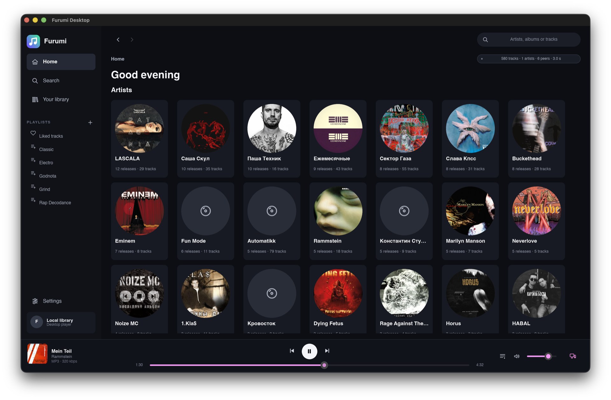

# Furumi Desktop



**Your music. Your devices. Your network.**

Furumi Desktop is a native graphical player for a personal music collection
and the Furumi federated network. It plays the library you keep on your own
computer, discovers music shared by other Furumi players, and streams missing
tracks directly from peers without requiring an account or a central catalog.

Pair your own players and they become one listening environment. Likes,
playlists, the queue, and playback state can move between trusted devices while
each player remains useful on its own.

Furumi Desktop targets **Linux, macOS, and Windows**.

## Why Furumi?

Music you own should not depend on a subscription, a remote account, or one
company's servers. Furumi is built around a different model:

- your local library stays under your control;
- the player works without a cloud backend;
- federation is optional and has no central search service;
- trusted devices synchronize directly with each other;
- missing music can be streamed from an available peer and retained locally.

A single player is a private desktop library. Several players form a resilient
personal music network.

## The player

The desktop interface is focused entirely on listening: artists, releases,
search, playlists, a reusable queue, and familiar playback controls. Local and
federated results share the same views, with clear availability indicators as
remote tracks arrive or become local.

Furumi Desktop also supports OS media keys, background playback, cover art,
trusted-device pairing, playback handoff, and control of another active Furumi
device. It uses the same library format and federation protocols as the Furumi
terminal player.

## Build and run

Rust 1.97 is pinned by `rust-toolchain.toml`.

```bash
cargo build --release --locked
./target/release/furumi-desktop
```

On Debian or Ubuntu, install the native Linux build dependencies first:

```bash
sudo apt install libasound2-dev libfontconfig1-dev libxkbcommon-dev pkg-config
```

A development shell with the Wayland and X11 dependencies is also provided:

```bash
nix-shell
cargo run --bin furumi-desktop
```

macOS and Windows require no additional system packages. Player settings are
available inside the application and are saved automatically.

## Architecture

Furumi Desktop is written in Rust with a reactive Slint interface, SQLite
persistence, Rodio audio playback, and the Frid/Furumi P2P protocol crates. It
ships as one application while keeping domain, application, backend, platform,
and presentation code in separate crates.

More detail is available in [ARCHITECTURE.md](ARCHITECTURE.md).

## Contributing

Bug reports, design discussions, and patches are welcome. Before submitting a
change, run:

```bash
cargo fmt --all -- --check
cargo clippy --workspace --all-targets -- -D warnings
cargo test --workspace --all-targets
```

## License

Furumi Desktop is released under the
[Do What The Fuck You Want To Public License, Version 2](LICENSE).
